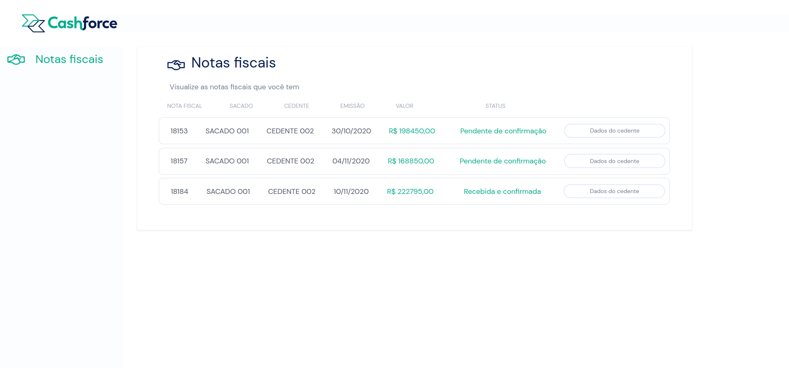

# Cashforce Test Documentation

## Sobre o projeto

- O projeto foi um desafio proposto pela equipe da Cashforce. Na sua estrutura principal ele é dividido em duas pastas principais, uma com o código *Frontend* e a outra com o *Backend*.

-Assim está a tela principal até o momento (10/01/2022)

## Stacks usadas

> Banco de dados:
- Mysql
- Prisma ORM

> Backend:
- Typescript
- Express

> Frontend:
- React.js + Vite
- Bootstrap
- Axios

## Como rodar a aplicação

> Banco de dados:
- O projeto usa um bando de dados mysql que possui todas as suas especificações declaradas dentro do arquivo *.env.example* que deverá ser substituído por um arquivo *.env*
- Para rodar o banco de dados com o *Docker* use o seguinte comando:
    `docker container run -d --name=cashforce -p 3306:3306 -e MYSQL_ROOT_PASSWORD=password mysql`

> Dentro da pasta *backend* rode os comandos:
 - `npm install` para instalar todas as dependências do projeto
 - `npx prisma migrate dev` para criar as migrations com *Prisma*
 - `npx prisma db seed` para popular o banco de dados com as Seeds
 - `npm start` para iniciar a aplicação na porta 3001
 - `npm run dev` para iniciar a aplicação usando o *nodemon*

> Dentro da pasta *frontend* rode os comandos:
 - `npm install` para instalar todas as dependências do projeto
 - `npm run dev` para iniciar a aplicação na porta 3000 com React + Vite

🚧 O Projeto continua em construção e ainda serão implementadas várias outras funcionalidades! 🚧